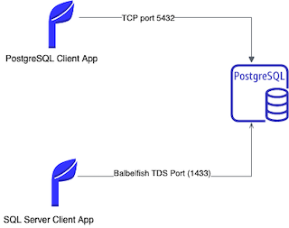

## Introduction
In this demo, we are going to show how the Babelfish for Aurora PostgreSQL new capability for Amazon Aurora with PostgreSQL-Compatibility edition works. Babelfish for Aurora PostgreSQL enables Amazon Aurora PostgreSQL-Compatible Edition to understand queries from applications written for Microsoft SQL Server. 

## Prerequisites
- AWS CLI
- A valid AWS Account
- Postgresql client. We will use [psql](https://www.postgresql.org/docs/9.3/app-psql.html)
- SQL server client. We will use [sqlcmd](https://docs.microsoft.com/en-us/sql/linux/sql-server-linux-setup-tools?view=sql-server-ver15)
- Python3

## Demo scenario

In this demo, we will show how to connect to Amazon Aurora PostgreSL cluster using a postgreSLQ client app psql and run queries again a postgres DB instance. We will then connect to the same cluster using the Babelfish capability of Amazon aurora with PostgreSQL-compatibility edition and run queries (create database, table and insert data to a table). The following diagram depicts a high level architecture of our demo environment.

## Step 1: Create an Amazon Aurora with PostgreSQL-compatibility edition cluster with Babelfish enabled

Sign in to the AWS Management Console and open the [Amazon RDS console](https://console.aws.amazon.com/rds)

- Click **Create database**.

- In Choose a database creation method, select **Standard create**.

- In Engine options, choose **Amazon Aurora**.

- Select **Amazon Aurora PostgreSQL-Compatible Edition** under Edition

  

- Under available versions select Aurora PostgreSQL (Compatible with PostgreSQL 13.4). Note that Babelfish is available for PostgreSQL 13.4 or higher

  

For the purpose of this demo only we will make the cluster public but make sure to only allow Internet traffic on TCP ports 5432 and 1433 from your computer IP address. This is done in the security group either from the [AWS console](https://docs.aws.amazon.com/vpc/latest/userguide/VPC_SecurityGroups.html) or from the command line

`aws ec2 authorize-security-group-ingress \
    --group-id sg-xxxxxxxx \
    --protocol tcp \
    --port 5432 \
    --cidr <REPLACE_ME_WITH_YOUR_IP_ADDR>`

Also allow ingress traffic for the babelfish TDS port on 1433 to accept SQL server queries. 

 `aws ec2 authorize-security-group-ingress \
    --group-id sg-xxxxxxxx \
    --protocol tcp \
    --port 1433 \
    --cidr <REPLACE_ME_WITH_YOUR_IP_ADDR>`

## Step 2: Connecting to Amazon Aurora postgreSQL using a postgres client (psql)

### Installing PostgreSQL client (psql)

Before we can connnect to the cluster, we need to install the PostgreSQL client app also known as psql. As I'm using MacOS, I will run the following commands:

`brew doctor`

`brew update`

`brew install libpq`

Please note that libpq does not install itself in `/usr/local/bin` so  you would have to create a symlink to the directory by running the command below:

`brew link --force libpq`  

The above command symlink all the postgresql client tools to the `/usr/local/bin directory`.

For other flavour of linux you can use the following commands to install postgresql client:

`sudo apt-get install postgresql-client` or `sudo yum install postgresqlxx` (replacing xx with the correct version)

Now let's run a test to check that the client installed properly.

	psql --version
	psql (PostgreSQL) 14.0
	
### Installing SQL server client (sqlcmd)

Please check the installation guide for your OS version from this [Microsoft online documentation](https://docs.microsoft.com/en-us/sql/linux/sql-server-linux-setup-tools?view=sql-server-ver15) 

For MacOS users, please run the commands below on your terminal to install sqlcmd:

	# brew untap microsoft/mssql-preview if you installed the preview version 
	brew tap microsoft/mssql-release https://github.com/Microsoft/homebrew-mssql-release
	brew update
	brew install mssql-tools
	#for silent install: 
	#HOMEBREW_NO_ENV_FILTERING=1 ACCEPT_EULA=y brew install mssql-tools

### Connecting to Amazon Aurora PostgreSQL using psql client

Now we can run psql to connect to the postgresql db just like a normal application would do

`psql --host=aurora-pgbabelfish-database-1.cluster-ro-cgdued2pbbld.us-west-2.rds.amazonaws.com --port=5432 --username=postgres --password --dbname=postgres`

`Password: <TYPE_IN_PASSWORD>`

**Output**

	psql (14.0, server 13.4)
	SSL connection (protocol: TLSv1.3, cipher: TLS_AES_256_GCM_SHA384, bits: 256, compression: off)
	Type "help" for help.

Now let's run a query to check the version of postgresql

`postgres=> SELECT version();`

**Output**

	                                                   version                                                   
	-------------------------------------------------------------------------------------------------------------
	 PostgreSQL 13.4 on aarch64-unknown-linux-gnu, compiled by aarch64-unknown-linux-gnu-gcc (GCC) 7.4.0, 64-bit
	(1 row)*

The output shows that it is version 13.4 which is the one we selected in the create database step.

Let's run another query (to list the available databases instances in the cluster)

**Listing databases in postgres**

`postgres=> \l`

**Output**

	                                     List of databases
	     Name     |  Owner   | Encoding |   Collate   |    Ctype    |    Access privileges     
	--------------+----------+----------+-------------+-------------+--------------------------
	 babelfish_db | postgres | UTF8     | en_US.UTF-8 | en_US.UTF-8 | =Tc/postgres            +
	              |          |          |             |             | postgres=CTc/postgres   +
	              |          |          |             |             | sysadmin=C*T*c*/postgres+
	              |          |          |             |             | master_dbo=CTc/sysadmin +
	              |          |          |             |             | tempdb_dbo=CTc/sysadmin
	 postgres     | postgres | UTF8     | en_US.UTF-8 | en_US.UTF-8 | 
	 rdsadmin     | rdsadmin | UTF8     | en_US.UTF-8 | en_US.UTF-8 | rdsadmin=CTc/rdsadmin
	 template0    | rdsadmin | UTF8     | en_US.UTF-8 | en_US.UTF-8 | =c/rdsadmin             +
	              |          |          |             |             | rdsadmin=CTc/rdsadmin
	 template1    | postgres | UTF8     | en_US.UTF-8 | en_US.UTF-8 | =c/postgres             +
	              |          |          |             |             | postgres=CTc/postgres
	(5 rows)

## Step 3: Connecting to Amazon Aurora postgreSQL using MS SQL server client (sqlcmd)

Now we are going to connect to the same postgresql cluster using a SQL server client sqlcmd and run SQL queries.

`sqlcmd -S aurora-pgbabelfish-database-1.cluster-ro-cgdued2pbbld.us-west-2.rds.amazonaws.com  -U postgres -P <REPLACE_ME_WITH_YOUR_PASSWORD> -Q "SELECT * FROM sys.schemas"`

	name                                                                                                                             schema_id   principal_id
	-------------------------------------------------------------------------------------------------------------------------------- ----------- ------------
	dbo                                                                                                                                    22397        22394

## Step 4: Testing - Running SQL queries

Now let's create a new db instance. This is done using the command below:

`sqlcmd -S aurora-pgbabelfish-database-1.cluster-ro-cgdued2pbbld.us-west-2.rds.amazonaws.com  -U postgres -P <REPLACE_ME_WITH_YOUR_PASSWORD> -Q "CREATE DATABASE testdb"`

Next, let's create a table in the newly created testdb database above.

	1> use testdb
	2> GO
	Changed database context to 'testdb'.

	1> CREATE TABLE dbo.customers
	2> (customerid int PRIMARY KEY NOT NULL,
	3> customername varchar(30) NOT NULL,
	4> accountbalance money NULL,
	5> address varchar(max) NULL)
	6> GO

And finally let's populate the table with data and run a select query to retrieve the data we inserted.

	1> INSERT dbo.customers (customerid, customername, accountbalance, address)  
	2> VALUES (1, 'James Hunn', 1000, '20 London street') 
	3> GO
	(1 rows affected)
	1> SELECT * from customers
	2> GO
	customerid  customername                   accountbalance        address                                                                                                                                                                                                                                                         
	----------- ------------------------------ --------------------- ----------------------------------------------------------------------------------------------------------------------------------------------------------------------------------------------------------------------------------------------------------------
	          1 James Hunn                                 1000.0000 20 London street  

## Step 5: Connecting to Amazon Aurora PostgreSQL using a python program

Let's use the db_conn.py which basically is a small python program that connects to our database cluster, run a select query and display the result to the terminal.

	import pypyodbc  
	
	#creating SQL Server Connection  
	conn = pypyodbc.connect('Driver={ODBC Driver 17 for SQL Server}};'
							'Server=REPLACE_WITH_YOUR_SERVER;'
							'Database=testdb;'
							'uid=REPLACE_ME_WITH_YOUR_USER;'
							'pwd=REPLACE_ME_WITH_YOUR_PASSWORD';)  
	
	cursor = conn.cursor()   
	  
	#Executing the query  
	cursor = conn.cursor()
	cursor.execute('SELECT * FROM customers')
	
	for i in cursor:
	    print(i)
	  
	#closing connection  
	conn.close()  

In the above program we are harcoding the db credentials for simplicity just for the demo purpose. However, in production it is not a recommended approach, instead you can use [AWS Secrets Manager](https://docs.aws.amazon.com/secretsmanager/latest/userguide/intro.html)

For the program to work we need to install the package pypyodbc by running the command below:

`pip3 install pypyodbc`

Also we need to install the odbc driver which is require for our python program to be able to connect to Amazon Aurora PostgreSQL via the TDS port 1433. Details on how to install it on MacOS can be found [here](https://docs.microsoft.com/en-us/sql/connect/odbc/linux-mac/install-microsoft-odbc-driver-sql-server-macos?view=sql-server-2017). If you are using another flavour of Linux you can the installation steps in this [MS online documentation](https://docs.microsoft.com/en-us/sql/connect/odbc/linux-mac/installing-the-microsoft-odbc-driver-for-sql-server?view=sql-server-ver15).

Also ensure that you replace the placeholders (REPLACE_ME_WITH_YOUR_XXX in the db_conn.py with the correct server, username and password values.

After completing the above step, you can now run the program which should return the results of the query to the console.

`$ python3 db_conn.py`
(1, 'James Hunn', Decimal('1000.0000'), '20 London street')
		
Remember to clean up the environment to free up resources!
	                                                                                                                                                          
## Conclusion

In this demo we showed how an application currently running on SQL Server could also run directly on Amazon Aurora with PostgreSQL-Compatibility edition with a fraction of the work required, compared to a traditional migration. Babelfish understands the SQL Server wire-protocol (TDS) and T-SQL, the Microsoft SQL Server query language, so you don't have to switch database drivers or re-write all of your application queries.You can connect to Babelfish by changing your SQL Server-based applications to point to the Babelfish TDS port on an Aurora PostgreSQL cluster, after turning Babelfish on

## Security

See [CONTRIBUTING](CONTRIBUTING.md#security-issue-notifications) for more information.

## Licence
This library is licensed under the MIT-0 License. See the LICENSE file.
